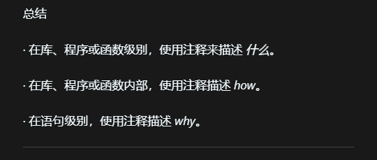

# 注释

## 代码说明

（这里写这段代码要解决什么问题、关键点是什么）

## 学习笔记

（记录遇到的坑、思路变化、调试过程和总结）
- 注释用来解释代码产生的前因后果，让后来者（包括自己）快速熟悉代码。
- 注释要根据背景信息，对代码提供联系上下文的解释。
- 

- 在库、程序或函数外部，注释来描述 “what”；
- 在库、程序或函数内部，注释来描述“how”；
- 在单行代码中，注释用来描述“why”；为什么代码指令是这样。 

- 只要注释是清晰的，有时候无需关心函数内部实现，直接使用就好了。 

---
更新于 2025.12.01 再次练习 注释

---
更新于 2025.12.01 再次练习 注释
