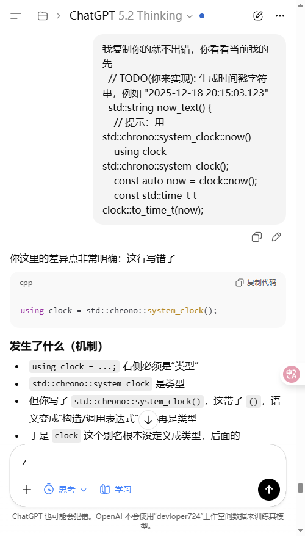
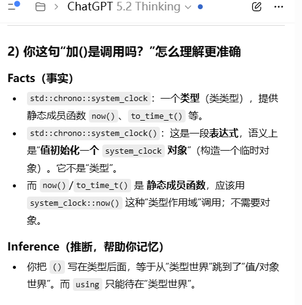
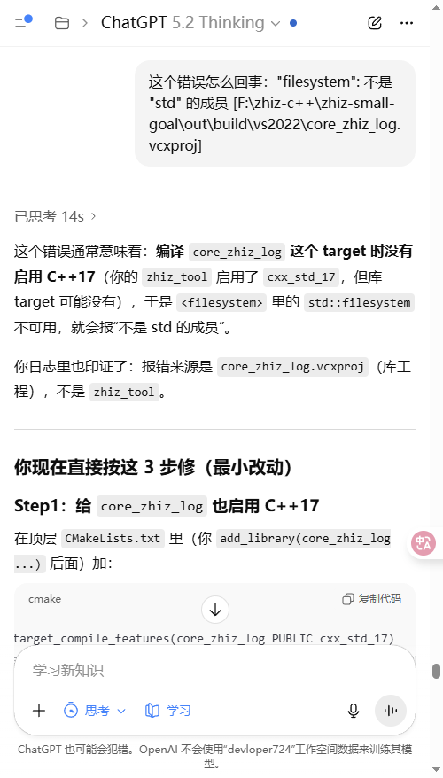
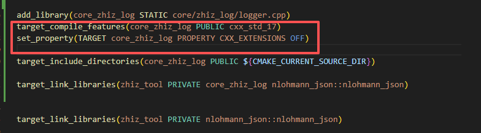
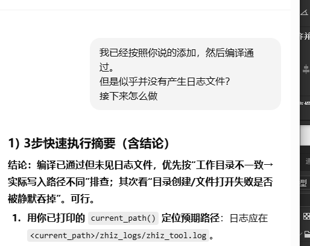
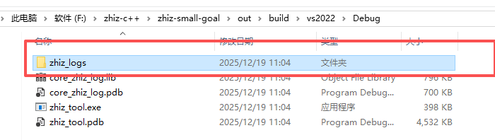

# 日志模块遭遇问题

## 1，代码写错：

  - 带括号和不带括号的区别:
    - 带括号：是表达式
    - 不带括号：是类型
    - using xx = 右边需要类型，静态成员函数

## 2，编译错误：target没有启用c++特性，filesystem 不是 std 的成员
- 根因：只给 zhiz_tool 设了 cxx_std_17，但新加的库 target core_zhiz_log 没有设标准，导致它不是按 C++17 编译。

- 正好跟前面的「设置c++特性」用全局（set）还是target（单独配置）的知识联系起来

- 解决方案：用同样的方法指定目标特性

## 3，日志路径问题：
  - 一开始没找到，以为在根目录的core/zhiz_log目录
  - 日志在Debug（launch.json的cwd）目录：

  - 解决方案：用脚本直接打开日志文件，不改日志生成位置

## 4，.gitignore误伤
- 创建日志代码的时候，因为直接使用「log」作为目录名，git的忽略文件把它忽略了

- 解决方案：把目录名改为「zhiz_log」

## 5，同时改了代码和写了学习笔记md，希望分开提交
- 在vscode的源代码管理器分别暂存
- 暂存后提交信息

- 最后统一推送

